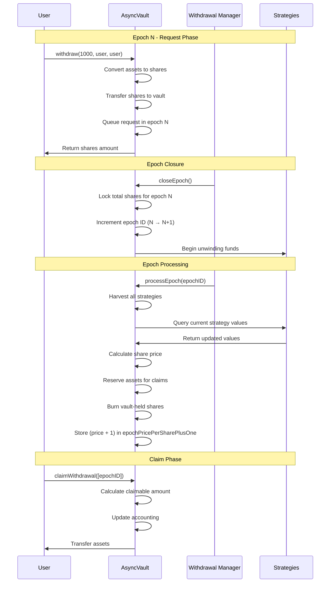
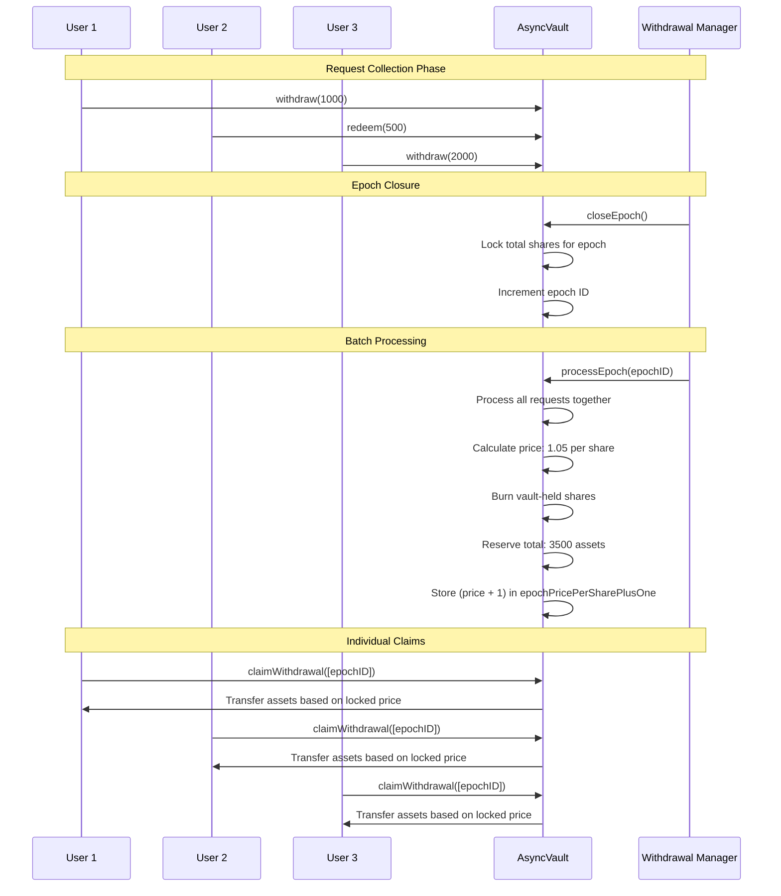

# ConcreteAsyncVaultImpl: Asynchronous Withdrawal System

## Technical Specification

---

## 1. Summary

The ConcreteAsyncVaultImpl introduces an epoch-based asynchronous withdrawal system that addresses liquidity management challenges in vault operations. Unlike traditional ERC4626 vaults where withdrawals execute immediately, this implementation batches withdrawal requests into processing epochs, providing withdrawal manager with controlled liquidity management to fill the queued exits.

---

## 2. Architecture Overview

### 2.1 Core Components

```
┌────────────────────────────────────────────────────────────────┐
│                ConcreteAsyncVaultImpl                          │
├────────────────────────────────────────────────────────────────┤
│  ┌─────────────────┐  ┌──────────────────┐  ┌─────────────────┐│
│  │  User Interface │  │  Withdrawal Mgr  │  │  Vault Manager  ││
│  │                 │  │                  │  │                 ││
│  │ • withdraw()    │  │ • closeEpoch()   │  │ • toggleQueue   ││
│  │ • redeem()      │  │ • processEpoch() │  │   Active()      ││
│  │ • claim()       │  │ • moveRequest    │  │                 ││
│  │ • cancel()      │  │   ToNextEpoch()  │  │                 ││
│  │                 │  │ • claimForUser() │  │                 ││
│  │                 │  │ • cancelForUser()│  │                 ││
│  │                 │  │ • claimUsers     │  │                 ││
│  │                 │  │   Batch()        │  │                 ││
│  └─────────────────┘  └──────────────────┘  └─────────────────┘│
├────────────────────────────────────────────────────────────────┤
│                    ConcreteStandardVaultImpl                   │
│              (Strategy Management & Base Functionality)        │
└────────────────────────────────────────────────────────────────┘
```

### 2.2 State Architecture

The async vault maintains additional state using a dedicated storage library (`ConcreteAsyncVaultImplStorageLib`) following ERC7201 storage pattern:

```solidity
struct ConcreteAsyncVaultImplStorage {
    // Current epoch ID for async withdrawals
    uint256 latestEpochID;
    // Assets available for past withdrawals (denominated in underlying asset)
    uint256 pastEpochsUnclaimedAssets;
    // Mapping from epoch ID to total shares requested in that epoch
    mapping(uint256 => uint256) totalRequestedSharesPerEpoch;
    // Mapping from user address to epoch ID to shares requested
    mapping(address user => mapping(uint256 epochID => uint256 shares)) userEpochRequests;
    // Mapping from epoch ID to (share price + 1) when that epoch was processed
    // Value of 0 indicates epoch not yet processed; non-zero = actual price + 1
    mapping(uint256 => uint256) epochPricePerSharePlusOne;
    // Whether the queue is active
    bool isQueueActive;
}
```

**Key Storage Changes:**

- **Multi-Epoch Support**: Users can have requests across multiple epochs simultaneously
- **Mapping-Based Design**: `userEpochRequests[user][epoch]` replaces single `RedeemRequest` struct
- **Gas Optimized**: Direct mapping lookups avoid array iterations
- **Storage Library**: Separated into `ConcreteAsyncVaultImplStorageLib.sol` for better architecture
- \*\*Queue toggeling feature: Allows the vault to work as a standard vault

---

## 3. Async Withdrawal Flow

### 3.1 Four-Phase Process

The async withdrawal system operates in four distinct phases:

#### Phase 1: Request Submission

1. Users call overridden ERC4626 functions (`withdraw()` or `redeem()`)
2. Requests are queued in the current epoch (`userEpochRequests[user][currentEpoch] += shares`)
3. Shares are transferred from user to vault
4. Multiple requests per user across different epochs are supported

#### Phase 2: Epoch Closure

1. Withdrawal Manager calls `closeEpoch()` to close the current epoch
2. Locks the total shares requested for the current epoch
3. Epoch can be closed even if empty (no requests)
4. Epoch ID is automatically incremented (rollover to new epoch)
5. Vault begins unwinding funds from strategies to prepare liquidity
6. Users can no longer cancel requests from the closed epoch

#### Phase 3: Epoch Processing

1. Withdrawal Manager calls `processEpoch(epochID)` to process a specific closed epoch
2. All pending requests for that epoch are batched and processed
3. Share price is calculated and locked for that specific epoch
4. Shares are burned from the vault
5. Assets are reserved for users claims
6. Price is stored as `epochPricePerSharePlusOne` (price + 1 to distinguish from unprocessed)

#### Phase 4: Claim Execution

1. Users call `claimWithdrawal(uint256[] epochIDs)` with array of epochs to claim
2. Assets are distributed based on locked epoch prices (aggregated across epochs)
3. Single transaction burns all shares and transfers all assets for gas efficiency
4. Reserved assets are released from vault

Alternatively, withdrawal manager can claim on behalf of users:

1. Withdrawal Manager calls `claimWithdrawal(user, uint256[] epochIDs)` for specific user
2. Assets are distributed based on locked epoch prices
3. Reserved assets are released from vault

### 3.2 State Transitions

```
Epoch N-1: CLOSED       Epoch N-1: PROCESSED   Epoch N: ACTIVE
┌─────────────────┐     ┌─────────────────┐     ┌─────────────────┐
│ • Shares locked │────▶│ • Claims ready  │     │ • Collecting    │
│ • Rollover to   │     │ • Price locked  │     │   requests      │
│   new epoch     │     │ • Assets        │     │ • Users can     │
│ • Start         │     │   reserved      │     │   cancel        │
│   unwinding     │     │ • Next epoch    │     │                 │
│   funds         │     │   can be closed │     │                 │
└─────────────────┘     └─────────────────┘     └─────────────────┘
```

---

## 4. User Interaction Flows

### 4.1 Standard Withdrawal Request Flow

```
User Journey: Alice wants to withdraw 1000 USDC

1. Alice calls: vault.withdraw(1000e6, alice, alice)
   ├── Vault converts 1000 USDC → ~995 shares (based on current rate)
   ├── Transfers 995 shares from Alice to vault
   ├── Creates/updates RedeemRequest for Alice in current epoch
   └── Emits WithdrawRequested(alice, 1000e6, currentEpoch)

2. Withdrawal Manager calls: vault.closeEpoch()
   ├── Locks total shares requested for the epoch
   ├── Increments epoch ID (rollover to new epoch)
   ├── Epoch can be closed even if empty
   ├── Begins unwinding funds from strategies
   └── Emits EpochClosed(epochId, totalShares)

3. Alice waits for epoch processing...

4. Withdrawal Manager calls: vault.processEpoch(epochId)
   ├── Calculates share price: 1.005 USDC/share
   ├── Burns 995 shares from vault
   ├── Reserves assets: 995 × 1.005 = ~1000 USDC
   ├── Stores epoch price as (price + 1) in epochPricePerSharePlusOne
   └── Emits EpochProcessed(epochId, totalShares, totalAssets, price)

5. Alice calls: vault.claimWithdrawal([epochId])
   ├── Calculates claimable: 995 × 1.005 = ~1000 USDC
   ├── Burns 995 shares from vault
   ├── Transfers 1000 USDC to Alice
   └── Emits RequestClaimed(alice, 1000e6)
```

### 4.2 Request Cancellation Flow

```
Before epoch is closed, Alice can cancel specific epoch requests:

1. Alice calls: vault.cancelRequest(epochID)
   ├── Validates request exists in specified epoch
   ├── Validates epoch is not yet closed (only open epochs can be cancelled)
   ├── Returns shares to Alice
   ├── Updates vault accounting for that epoch
   └── Emits RequestCancelled(alice, shares, epochID)

Note: Once an epoch is closed via closeEpoch(), requests can no longer be cancelled.

Alternatively, withdrawal manager can cancel requests on behalf of users:

2. Withdrawal Manager calls: vault.cancelRequest(user, epochID)
   ├── Validates user address is not zero
   ├── Validates request exists in specified epoch
   ├── Validates epoch is not yet closed
   ├── Returns shares to the specified user
   ├── Updates vault accounting for that epoch
   └── Emits RequestCancelled(user, shares, epochID)
```

### 4.3 Multi-Epoch Claiming Flow

```
Alice has requests in epochs 5, 7, and 9 (all processed):

1. Alice calls: vault.claimWithdrawal([5, 7, 9])
   ├── Processes epoch 5: calculates assets using locked price
   ├── Processes epoch 7: calculates assets using locked price
   ├── Processes epoch 9: calculates assets using locked price
   ├── Aggregates total assets and shares
   ├── Burns total shares from vault in single operation
   ├── Transfers total assets to Alice in single operation
   └── Emits RequestClaimed(alice, totalAssets)

Alternatively, withdrawal manager can claim on behalf of users:

2. Withdrawal Manager calls: vault.claimWithdrawal(user, [5, 7, 9])
   ├── Validates user address is not zero
   ├── Processes epochs 5, 7, and 9 for the specified user
   ├── Aggregates total assets and shares for the user
   ├── Burns total shares from vault in single operation
   ├── Transfers total assets to the specified user
   └── Emits RequestClaimed(user, totalAssets)
```

### 4.4 Batch User Claiming Flow

```
Withdrawal Manager can process claims for multiple users in a single epoch:

1. Withdrawal Manager calls: vault.claimUsersBatch([user1, user2, user3], epochID)
   ├── Validates users array is not empty
   ├── Validates epoch has been processed (price is locked)
   ├── For each user with requests in the epoch:
   │   ├── Calculates claimable assets using locked epoch price
   │   ├── Clears user's request from the epoch
   │   ├── Transfers assets directly to the user
   │   └── Emits RequestClaimed(user, assets)
   ├── Updates vault accounting to release reserved assets
   └── Optimized for gas efficiency with single epoch price lookup
```

---

## 5. Sequence Diagrams

### 5.1 Complete Withdrawal Cycle



### 5.2 Multi-User Epoch Processing



---

## 6. Enhanced Epoch Management

### 6.1 Epoch Lifecycle Operations

The async vault implementation provides comprehensive epoch management with three key operations:

#### `closeEpoch()`

- **Purpose**: Close the current epoch and transition to the next epoch
- **Functionality**:
  - Locks the total shares requested for the current epoch
  - Increments `latestEpochID` (rollover to new epoch)
  - Can close epoch even if empty (no pending requests)
  - Signals vault to begin unwinding funds from strategies
  - After closure, requests in that epoch can no longer be cancelled
- **Access Control**: Only callable by `WITHDRAWAL_MANAGER` role
- **Modifiers**: `nonReentrant`
- **State Changes**:
  - Increments `latestEpochID`
  - Freezes `totalRequestedSharesPerEpoch[closedEpochID]`
- **Emits**: `EpochClosed(epochID, totalShares)`

#### `processEpoch(uint256 epochID)`

- **Purpose**: Process withdrawal requests for a specific closed epoch
- **Functionality**:
  - Processes a previously closed epoch (not necessarily the most recent)
  - Calculates share price using `_convertToAssets()`
  - Validates sufficient liquid assets are available
  - Burns shares held by the vault for this epoch
  - Reserves assets for future claiming
  - Stores (price + 1) in `epochPricePerSharePlusOne[epochID]` to distinguish from unprocessed (0)
- **Access Control**: Only callable by `WITHDRAWAL_MANAGER` role
- **Parameters**: `epochID` - The ID of the closed epoch to process
- **Modifiers**: `withYieldAccrual`, `nonReentrant`
- **State Changes**:
  - Updates `pastEpochsUnclaimedAssets`
  - Clears `totalRequestedSharesPerEpoch[epochID]`
  - Stores `epochPricePerSharePlusOne[epochID] = price + 1`

#### `moveRequestToNextEpoch(address user)`

- **Purpose**: Move a user's withdrawal request from current epoch to next epoch
- **Functionality**:
  - Moves user's shares from current epoch to next epoch
  - Updates both current and next epoch request mappings
  - Maintains total requested shares per epoch accounting
- **Access Control**: Only callable by `WITHDRAWAL_MANAGER` role
- **Parameters**: `user` - Address of the user whose request to move
- **State Changes**:
  - Decreases `userEpochRequests[user][currentEpoch]`
  - Increases `userEpochRequests[user][nextEpoch]`
  - Updates `totalRequestedSharesPerEpoch` for both epochs

#### **Use Cases for Epoch Management**

1. **Liquidity Management**: Close epochs to begin unwinding, move requests when insufficient liquidity
2. **User Assistance**: Help users who need to delay their withdrawals
3. **Operational Flexibility**: Manage withdrawal timing based on market conditions
4. **Emergency Handling**: Process epochs out of order if needed, move requests during operational issues
5. **Empty Epochs**: Close empty epochs to advance the system even without pending requests

#### **Processing Flow Example**

```solidity
// Example: Standard epoch lifecycle
vault.closeEpoch(); // Close current epoch, increment to next

// Wait for liquidity to be arranged...

vault.processEpoch(closedEpochID); // Process specific closed epoch

// Example: Moving a user's request to next epoch
vault.moveRequestToNextEpoch(userAddress); // Move user's request forward
```

#### **Technical Constraints**

- `closeEpoch()` can only close the current (latest) epoch
- `processEpoch(epochID)` can process any closed epoch that hasn't been processed yet
- Each epoch can only be processed once (prevents double processing)
- Epochs must be closed before they can be processed
- Sufficient vault liquidity must be available for processing
- Share prices are locked at the time of processing, not at request or closure time
- `epochPricePerSharePlusOne` value of 0 means unprocessed, non-zero means processed (subtract 1 for actual price)

### 6.3 Operational Benefits

#### **For Withdrawal Manager**

- **Epoch Control**: Separate epoch closure from processing allows better liquidity planning
- **Liquidity Planning**: Close epochs to signal unwinding, then process when liquidity is ready
- **Risk Management**: Process epochs only when sufficient liquidity is confirmed
- **Batch Efficiency**: Handle multiple epochs in planned operational windows
- **Emergency Handling**: Address processing backlogs without losing user requests, process out of order if needed
- **Operational Flexibility**: Close new epochs even when previous epochs need more time for liquidity arrangement
- **Empty Epoch Support**: Close empty epochs to advance the system even without pending requests

#### **For Users**

- **Batch Claiming**: Claim multiple epochs in single transaction for gas efficiency
- **Fair Pricing**: All users in same epoch get identical share price regardless of processing timing
- **Request Flexibility**: Can cancel requests from open epochs (before `closeEpoch()` is called) using `cancelRequest(epochID)`
- **ERC4626 Compliance**: `maxWithdraw()` and `maxRedeem()` return expected values for integration compatibility
- **Allowance Support**: Third parties can make withdrawals on behalf of users with proper ERC20 allowances
- **Withdrawal Manager Assistance**: Withdrawal manager can cancel or claim requests on behalf of users when needed

---

## 7. Technical Implementation Details

### 7.1 Price Calculation

Share price is determined at epoch processing time using the vault's current state:

```solidity
uint256 sharePrice = _convertToAssets(10 ** decimals(), Math.Rounding.Floor);
```

This ensures all users in the same epoch receive the same conversion rate, regardless of when they submitted their request or when they claim.

The price is stored as `(sharePrice + 1)` in `epochPricePerSharePlusOne` to distinguish processed from unprocessed epochs:

```solidity
// Storing the price
epochPricePerSharePlusOne[epochID] = sharePrice + 1;

// Retrieving the price
uint256 storedValue = epochPricePerSharePlusOne[epochID];
if (storedValue == 0) {
    revert EpochNotProcessed(epochID);
}
uint256 actualPrice = storedValue - 1;
```

This mechanism allows checking if an epoch has been processed (non-zero value) versus unprocessed (zero value) without requiring additional state variables.

### 7.2 Asset Reservation

When an epoch is processed, assets are reserved to guarantee claim fulfillment:

```solidity
uint256 assetsNeeded = requestingShares.mulDiv(
    sharePrice,
    10 ** decimals(),
    Math.Rounding.Floor
);
pastEpochsUnclaimedAssets += assetsNeeded;
```

Floor operation is used - any rounding error benefits the protocol. When individual withdrawals are claimed by the users they are also rounded down. The sum of all claimed withdrawals is guaranteed to be less or equal the assetsNeeded due to the applied rounding. (N floor operations on N parts will sum to a number less or equal the original number after floor operation).

### 7.3 Liquidity Management

The vault checks available liquidity before processing an epoch:

```solidity
uint256 availableAssets = IERC20(asset()).balanceOf(address(this));
if (availableAssets < pastEpochsUnclaimedAssets + assetsNeeded) {
    revert InsufficientBalance();
}
```

### 7.4 ERC20 Allowance Integration

The async vault properly handles ERC20 allowances for third-party withdrawals:

```solidity
function _executeWithdraw(address caller, address receiver, address owner, uint256 assets, uint256 shares) {
    if ($.isQueueActive) {
        if (caller != owner) {
            _spendAllowance(owner, caller, shares);  // ERC20 allowance check
        }
        // ... async withdrawal logic
    } else {
        return super._executeWithdraw(caller, receiver, owner, assets, shares);
    }
}
```

This ensures that:

- **Owner withdrawals**: No allowance required (caller == owner)
- **Third-party withdrawals**: Proper allowance validation and spending
- **Security**: Prevents unauthorized withdrawals
- **ERC4626 compliance**: Follows standard allowance patterns
